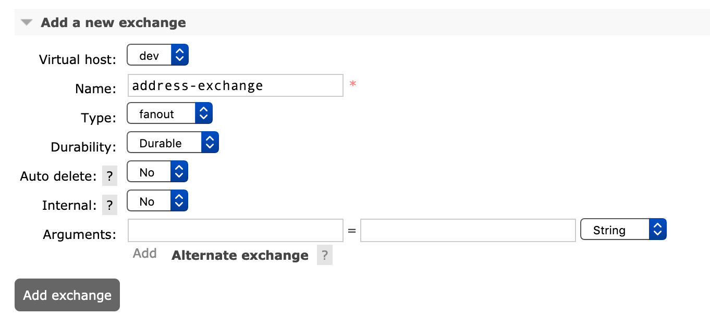
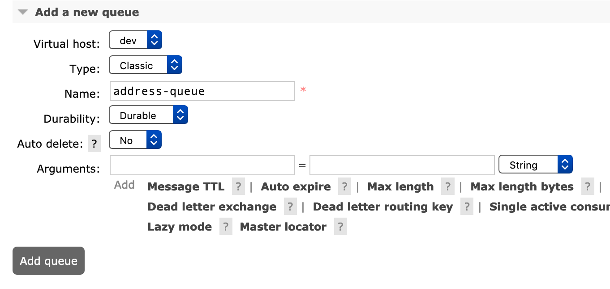
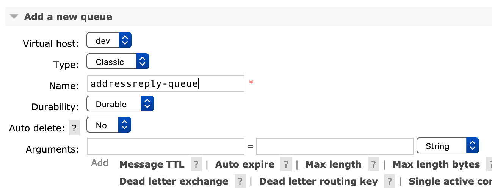
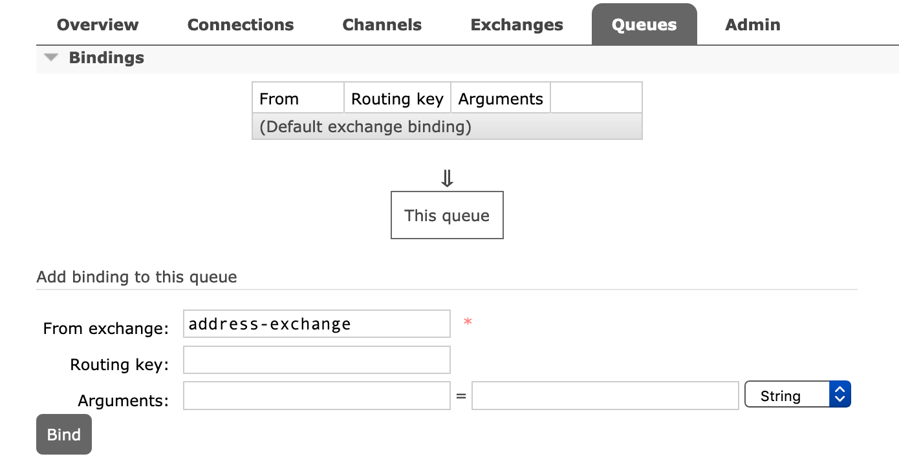
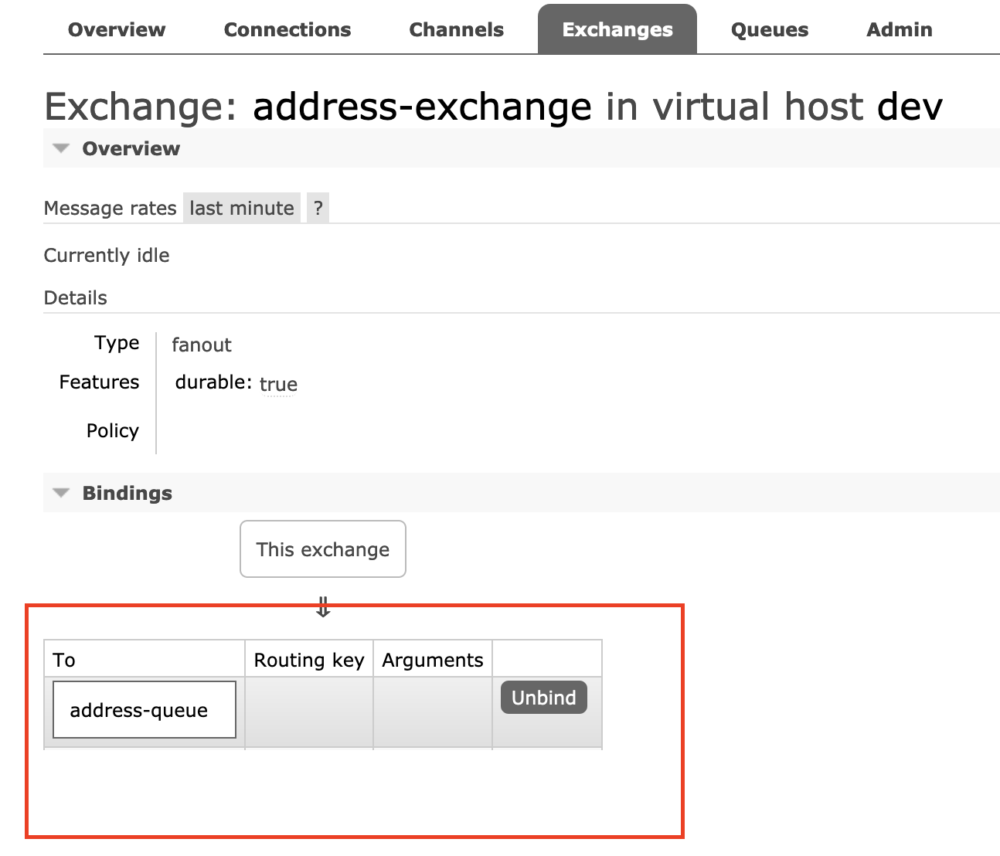

# Request-Reply Pattern using Correlation ID

This is an example to showcase how request reply pattern using Correlation ID can be achieved. We use RabbitMQ to implement this pattern

### What?

This is a simple example of how to implement Request-Reply pattern using Correlation-ID, where a requestor application sends a request, a replier application
receives the request and returns a reply, and the requestor receives the reply. 

For simplicity both the requestor and reply flow are bundled into same Mule application.

### How?

The following diagram articulates how this is implemented:

### Usage
To test this example, you will require access to RabbitMQ. If not you can install it locally:

For RabbitMQ installation instructions please follow the link below :-
https://www.rabbitmq.com/download.html

After successful installation you should be able to run it Using

export PATH=$PATH:/usr/local/opt/rabbitmq/sbin
sudo rabbitmq-server

To access Rabbit MQ use the following url :-
http://localhost:15672/

Create Queues and Exchanges as per your configuration file.

Create Exchange as Fanout  :-

Create queue as follows :-

Create reply queue as follows :-

Create queue binding as follows :-

Verify binding in exchange as shown below:-

#### Development

##### Dependencies

Rabbit MQ

### Contribution

### Todos

License
----
UNLICENSED
